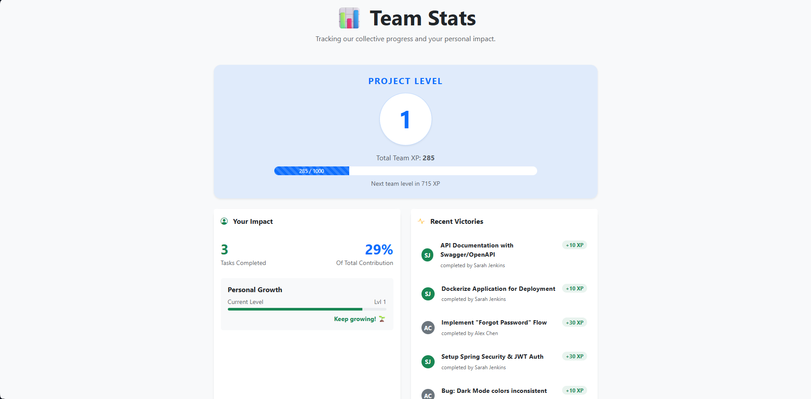
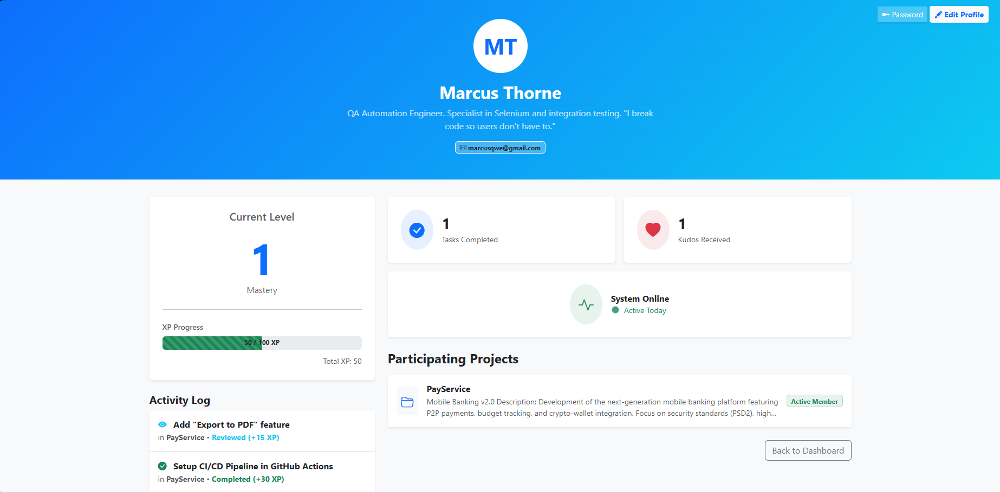
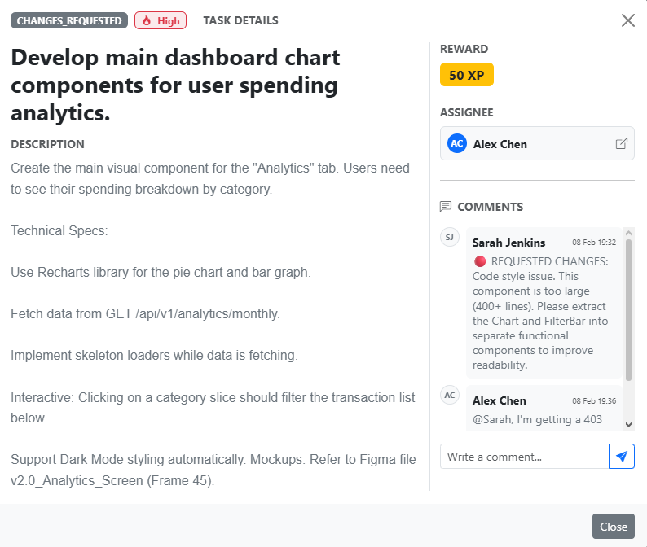

# MakoDev | Gamified Project Management System


**MakoDev** is a prototype project management tool designed to **combat developer burnout** and increase team engagement through ethical gamification.

Developed as a **Bachelor's Diploma Thesis** at the University of Hradec Králové.
*Topic: Gamification in software development and its impact on team cooperation.*

Unlike traditional trackers (Jira, Trello), MakoDev integrates RPG mechanics — XP, levels, and cooperation — directly into the software development lifecycle, rewarding not just "done" tasks, but also quality code reviews and teamwork.

---

## 📸 Screenshots

### 1. Interactive Task Board
*(The heart of the application. Drag-and-drop tasks, see priorities and XP rewards.)*


---

### 2. Team Statistics & Transparency
*(Visualizing individual impact prevents free-riding and highlights contribution.)*


---

### 3. Gamification Details
| **User Profile** | **Task Details** |
|:---:|:---:|
|  |  |
| *Level progression, stats & activity log* | *Comments, peer reviews, and all needed details* |
---

## 🚀 Key Features

### 🎮 Gamification Engine
* **XP System:** Developers earn Experience Points (XP) for completing tasks. Rewards scale dynamically with task complexity (Easy: 10XP to Epic: 100XP).
* **Leveling Up:** Visual progression system based on accumulated XP.
* **Kudos System:** A peer-to-peer reward mechanic. Team members can award "Likes" (Kudos) to colleagues, boosting team morale and earning social XP.
* **Non-Toxic Environment:** No global leaderboards that pit users against each other. The focus is on **Self-Improvement** and **Team Progress** rather than unhealthy competition.

### 🛡 Burnout Protection (Well-being)
* **Weekend Mode:** The system automatically detects weekends. Working on Saturday/Sunday triggers visual warnings to encourage rest and work-life balance.
* **Daily Energy Cap:** A strict daily limit of 100 XP ensures developers don't overwork. Once the cap is reached, XP gain is disabled for the remainder of the day.

### 🔄 Professional Workflow & Transparency
* **Code Review First:** Tasks follow a strict quality gate: `To Do` → `In Progress` → `Code Review` → `Done`.
* **Reviewer Rewards:** Unlike standard systems, MakoDev rewards the **Reviewer** with XP (15 XP), motivating team members to perform quality control and help others.
* **Transparent Contribution:** 
    * The **Team Stats** page visualizes individual impact. Users can see their specific contribution percentage and task count relative to the team.
    * Completed tasks display both the Assignee and the Reviewer, ensuring credit is shared fairly.
* **Interactive Feedback Loop:** 
    * Tasks support comments and a "Request Changes" flow (returning tasks to development).
    * User profiles display a complete history of completed tasks and performed reviews.
---

## 🛠 Technology Stack

The application is built as a monolithic web application using **Server-Side Rendering (SSR)** for security and performance.

* **Backend:** Java 17, Spring Boot 3 (Web, Data JPA, Security).
* **Frontend:** Thymeleaf, Bootstrap 5, Bootstrap Icons.
* **Database:** PostgreSQL.
* **Security:** Spring Security.
* **Build Tool:** Maven.

---

## ⚙️ How to Run Locally

### Prerequisites
* JDK 17 or higher
* Maven

### 1. Clone the repository
```bash
git clone https://github.com/cknnk/makoDev.git
cd MakoDev
```

### 2. Database Configuration
``` properties
spring.datasource.url=jdbc:postgresql://localhost:5432/makoDev
spring.datasource.username=postgres
spring.datasource.password=your_password
spring.jpa.hibernate.ddl-auto=update
```

### 3. Build and Run
``` 
mvn spring-boot:run
```

### 4. Access the App
Open your browser at: http://localhost:8080
* Register: Create a new account via the /register page.
* Login: Use your new credentials.

---

## 🧪 Project Architecture

The project follows a clean MVC (Model-View-Controller) pattern with a dedicated Service Layer to handle business logic.

* `controller`: Handles HTTP requests.
* `service`: Contains the core logic (XP calculation, Gamification rules, Transaction management).
* `data`: JPA Entities (User, Task, Project) and Repositories.
* `security`: Configuration for password encoding and session management.

---

## 🎓 Author

Maksym Kovalov
*Faculty of Informatics and Management*
*University of Hradec Králové*
Year: 2026

---
*MakoDev © 2026*
