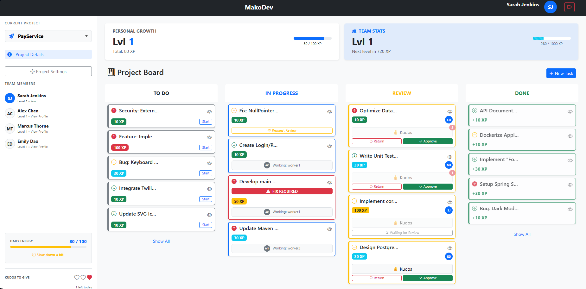
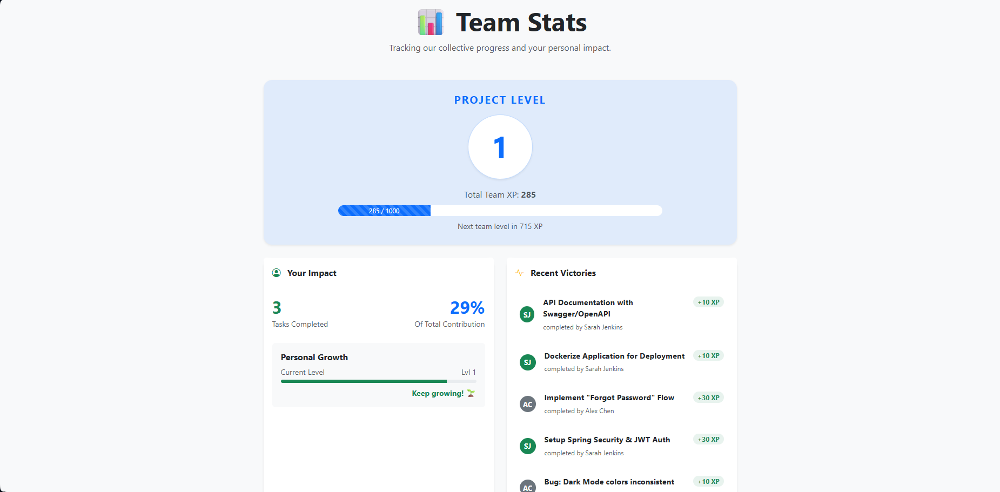
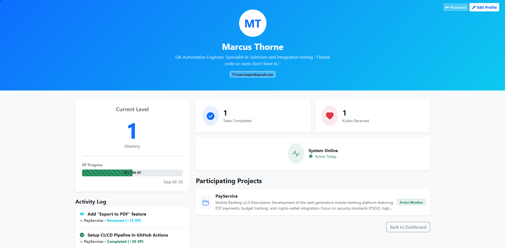
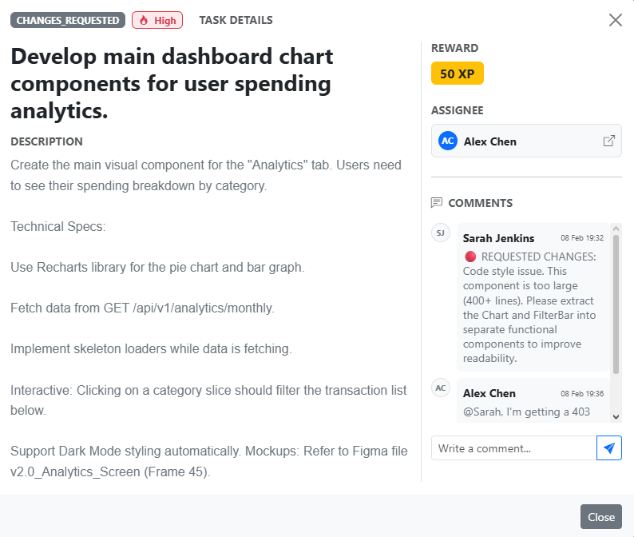

# MakoDev | Gamified Project Management System


**MakoDev** is a prototype project management tool designed to **combat developer burnout** and increase team engagement through ethical gamification.

Developed as a **Bachelor's Diploma Thesis** at the University of Hradec Králové.
*Topic: Gamification in software development and its impact on team cooperation.*

Unlike traditional trackers (Jira, Trello), MakoDev integrates RPG mechanics — XP, levels, and cooperation — directly into the software development lifecycle, rewarding not just "done" tasks, but also quality code reviews and teamwork.

---

## 📸 Screenshots

### 1. Interactive Task Board
*(The heart of the application. Drag-and-drop tasks, see priorities and XP rewards.)*


---

### 2. Team Statistics & Transparency
*(Visualizing individual impact prevents free-riding and highlights contribution.)*


---

### 3. Gamification Details
|             **User Profile**              |                 **Task Details**                 |
|:-----------------------------------------:|:------------------------------------------------:|
|  |      |
| *Level progression, stats & activity log* | *Comments, peer reviews, and all needed details* |
---

## 🚀 Key Features

### 🎮 Gamification Engine
* **XP System:** Developers earn Experience Points (XP) for completing tasks. Rewards scale dynamically with task complexity (Easy: 10XP to Epic: 100XP).
* **Leveling Up:** Visual progression system based on accumulated XP.
* **Kudos System:** A peer-to-peer reward mechanic. Team members can award "Likes" (Kudos) to colleagues, boosting team morale and earning social XP.
* **Non-Toxic Environment:** No global leaderboards that pit users against each other. The focus is on **Self-Improvement** and **Team Progress** rather than unhealthy competition.

### 🛡 Burnout Protection (Well-being)
* **Weekend Mode:** The system automatically detects weekends. Working on Saturday/Sunday triggers visual warnings to encourage rest and work-life balance.
* **Daily Energy Cap:** A strict daily limit of 100 XP ensures developers don't overwork. Once the cap is reached, XP gain is disabled for the remainder of the day.

### 🔄 Professional Workflow & Transparency
* **Code Review First:** Tasks follow a strict quality gate: `To Do` → `In Progress` → `Code Review` → `Done`.
* **Reviewer Rewards:** Unlike standard systems, MakoDev rewards the **Reviewer** with XP (15 XP), motivating team members to perform quality control and help others.
* **Transparent Contribution:** 
    * The **Team Stats** page visualizes individual impact. Users can see their specific contribution percentage and task count relative to the team.
    * Completed tasks display both the Assignee and the Reviewer, ensuring credit is shared fairly.
* **Interactive Feedback Loop:** 
    * Tasks support comments and a "Request Changes" flow (returning tasks to development).
    * User profiles display a complete history of completed tasks and performed reviews.
---

## 🛠 Technology Stack

The application is built as a monolithic web application using **Server-Side Rendering (SSR)** for security and performance.

* **Backend:** Java 17, Spring Boot 3 (Web, Data JPA, Security).
* **Frontend:** Thymeleaf, Bootstrap 5, Bootstrap Icons.
* **Database:** PostgreSQL.
* **Security:** Spring Security.
* **Build Tool:** Maven.
* **Deployment:** Docker & Docker Compose.

---

## ⚙️ How to Run (Docker - Recommended)

The easiest way to review the project is by using Docker. The application comes with a pre-configured database populated with test data (tasks, projects, and users) so you can test the social features immediately.

### Prerequisites
* Docker & Docker Compose installed.

### Steps to Run
1. Unzip the project archive and navigate to the root directory in your terminal.
2. Run the following command to build and start the application:
```bash
docker-compose up --build -d
```
3. Wait approximately 30-60 seconds for the database to initialize and the Spring Boot application to start.
4. Open your browser and go to: http://localhost:8080

### 👥 Test Accounts (Pre-loaded Data)
You can log in using any of the following pre-configured accounts to see the gamification system in action from different perspectives:

| Role / Username | Password |
|:----------------|:---------|
| **worker1**     | `123`    |
| **worker2**     | `123`    |
| **worker3**     | `123`    |
| **worker4**     | `123`    |

*Note: You can also register a completely new account using the 'Register' page.*

### How to Stop
To stop the application and remove the containers, run:
```bash
docker-compose down
```

### 💻 Alternative: Run Locally (Without Docker)
If you prefer to run the application directly via Maven (e.g., for development or code review), ensure you have **Java 17**, **Maven**, and a local **PostgreSQL** instance running.

1. **Configure the Database:**
   Ensure you have a local database named `makoDev` running on port `5432`. Update your `src/main/resources/application.properties` if your local credentials differ:
   ```properties
   spring.datasource.url=jdbc:postgresql://localhost:5432/makoDev
   spring.datasource.username=postgres
   spring.datasource.password=your_password
   ```
2. **Build and Run:**
   ```bash
   mvn clean install -DskipTests
   mvn spring-boot:run
   ```
---

## 🧪 Project Architecture

The project follows a clean MVC (Model-View-Controller) pattern with a dedicated Service Layer to handle business logic.

* `controller`: Handles HTTP requests.
* `service`: Contains the core logic (XP calculation, Gamification rules, Transaction management).
* `data`: JPA Entities (User, Task, Project) and Repositories.
* `security`: Configuration for password encoding and session management.

---

## 🎓 Author

Maksym Kovalov
*Faculty of Informatics and Management*
*University of Hradec Králové*
Year: 2026

---
*MakoDev © 2026*
